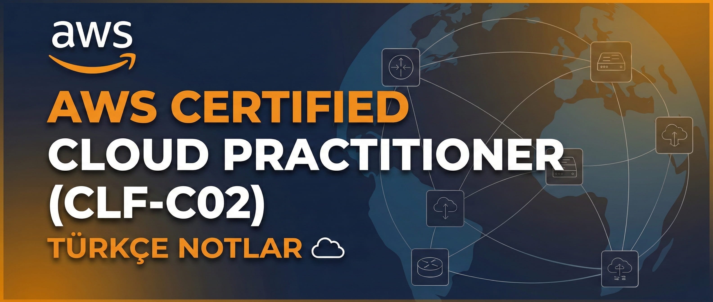

  
  
  

  

  # AWS Certified Cloud Practitioner (CLF-C02) - Türkçe Notlar ☁️
  
  Bu repository, **AWS Certified Cloud Practitioner** sınavı için aldığım notları ve sınav ipuçlarını içeren bir yönlendirme kaynağıdır. Notlar "AWS SkillBuilder - AWS Cloud Practitioner Essentials" kursundan alınmıştır ve cheatsheet formatında derlenmiştir. Sınavda karşına çıkabilecek temel kavramları ve hizmetleri hızlıca gözden geçirmek için idealdir.
  
  Tüm güncel içeriklere, cloud ve siber güvenlik ile ilgili yazılara **[hackpaper.netlify.app](https://hackpaper.netlify.app/)** adresi üzerinden ulaşabilirsin.
  

---

Aşağıdaki listeden ilgili konunun detaylı anlatımına ulaşabilirsiniz:

| # | Konu Görseli | Konu Başlığı ve Link |
|:-:|:---:|:---|
| **1** |  | **AWS ve Bulut Bilişim Temelleri** Bulut kavramlarına giriş ve temel terminoloji. 🔗 **[Makaleyi Oku](https://hackpaper.netlify.app/2025/aws-ve-bulut-bilisim-temelleri)** |
| **2** |  | **Amazon EC2 ve Temel Servisler** Sanal sunucular ve temel yapı taşları. 🔗 **[Makaleyi Oku](https://hackpaper.netlify.app/2025/aws-ec2-ve-temel-servisler)** |
| **3** |  | **AWS Hesaplama (Compute) Hizmetlerini Keşfetme** Lambda, ECS, Fargate ve diğerleri. 🔗 **[Makaleyi Oku](https://hackpaper.netlify.app/2025/aws-compute-hizmetlerini-kesfetme)** |
| **4** |  | **AWS Küresel Altyapısı ve Ölçeklenebilirlik** Regions, AZs ve Edge Locations yapısı. 🔗 **[Makaleyi Oku](https://hackpaper.netlify.app/2025/aws-kuresel-altyapisi-ve-olceklenebilirlik)** |
| **5** |  | **AWS Networking (Ağ Hizmetleri)** VPC, Subnet, Security Groups ve Route 53. 🔗 **[Makaleyi Oku](https://hackpaper.netlify.app/2025/aws-networking)** |
| **6** |  | **AWS Depolama Hizmetleri** S3, EBS, EFS ve Storage Gateway. 🔗 **[Makaleyi Oku](https://hackpaper.netlify.app/2025/aws-storage)** |
| **7** |  | **AWS Veritabanı Hizmetleri** RDS, DynamoDB, Aurora ve Redshift. 🔗 **[Makaleyi Oku](https://hackpaper.netlify.app/2025/aws-databases)** |
| **8** |  | **AWS AI/ML ve Veri Analitiği** Yapay zeka servisleri ve büyük veri. 🔗 **[Makaleyi Oku](https://hackpaper.netlify.app/2025/aws-ai-ml-ve-veri-analitigi)** |
| **9** |  | **AWS Security** IAM, WAF, Shield ve Güvenlik prensipleri. 🔗 **[Makaleyi Oku](https://hackpaper.netlify.app/2025/aws-security)** |
| **10** |  | **AWS Bulut Yönetimi: Temel İlkeler** CloudWatch, CloudTrail ve yönetim araçları. 🔗 **[Makaleyi Oku](https://hackpaper.netlify.app/2025/aws-bulut-yonetimi-temel-ilkeler-ve-hizmetler)** |
| **11** |  | **AWS Maliyet Yönetimi ve Destek** Fiyatlandırma modelleri, Budgets ve Destek planları. 🔗 **[Makaleyi Oku](https://hackpaper.netlify.app/2025/aws-maliyet-yonetimi-ve-destek-hizmetleri)** |
| **12** |  | **AWS Göç ve Modernizasyon** Cloud Adoption Framework ve Migration araçları. 🔗 **[Makaleyi Oku](https://hackpaper.netlify.app/2025/aws-goc-ve-modernizasyon)** |
| **13** |  | **AWS İyi Mimari (Well-Architected)** İyi mimari prensipleri ve en iyi uygulamalar. 🔗 **[Makaleyi Oku](https://hackpaper.netlify.app/2025/aws-iyi-mimari-icin-hizmetler)** |

---

## 🎯 Hedef Kitle
* AWS'e yeni başlayanlar.
* CLF-C02 sınavına hazırlananlar.
* Bulut teknolojileri terminolojisini Türkçe öğrenmek isteyenler.

## Sorumluluk Reddi (Disclaimer)

Bu repository'de yer alan notlar, **AWS Certified Cloud Practitioner (CLF-C02)** sınavına hazırlık sürecimdeki kişisel çalışma notlarımı içermektedir.

* **Resmiyet:** Bu notlar Amazon Web Services (AWS) ile resmi bir bağlantıya sahip değildir ve AWS tarafından doğrulanmamıştır.
* **Doğruluk:** Bilgilerin doğruluğu ve güncelliği konusunda garanti verilmemektedir. AWS servisleri ve sınav içerikleri zamanla değişebilir.
* **Sorumluluk:** Bu notların kullanımından doğabilecek herhangi bir sınav başarısızlığı veya hatadan yazar sorumlu tutulamaz.

*AWS, Amazon Web Services ve ilgili logolar Amazon.com, Inc. veya iştiraklerinin ticari markalarıdır.*

## 🤝 Katkıda Bulunma
Hatalı bir bilgi görürseniz veya ekleme yapmak isterseniz blog üzerinden yorum göndermekten çekinmeyin!

  © 2025 HackPaper

